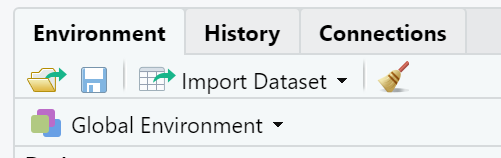
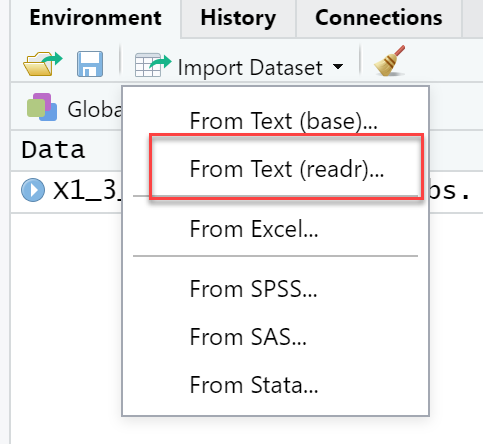
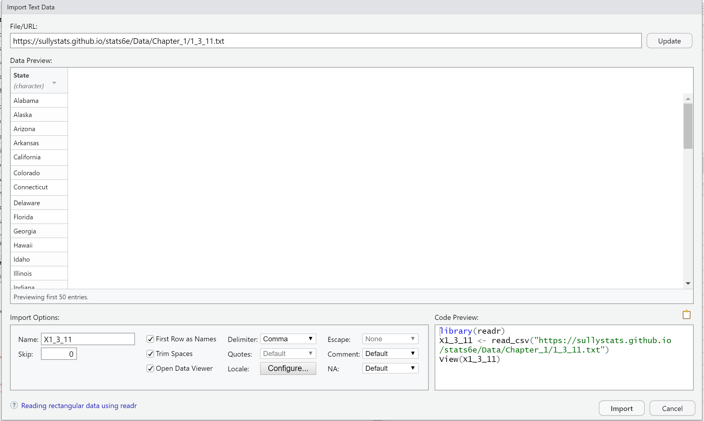

# How to Upload Data to R Studio

<b>Step 1:</b> Select "Import Dataset" from the upper-right window. 

<b>Step 2:</b> Select "From Text (readr...)"  Note: You may need to install or update the package. 

<b>Step 3:</b> After selecting "readr", enter the URL of the data set into the window as shown below.  Note that all data sets on the SullyStats Github are of the form   

                https://sullystats.github.io/stats6e/Data/Chapter_#/#_s_n.txt  

where  
<ul>
  <li># is the chapter number</li>
  <li>s is the section number</li>
  <li>n is the problem number>/li>
</ul>

<b>Step 4:</b> Click Update. You should see a preview of the data set. 

<b>Step 5:</b> Click Import. 
