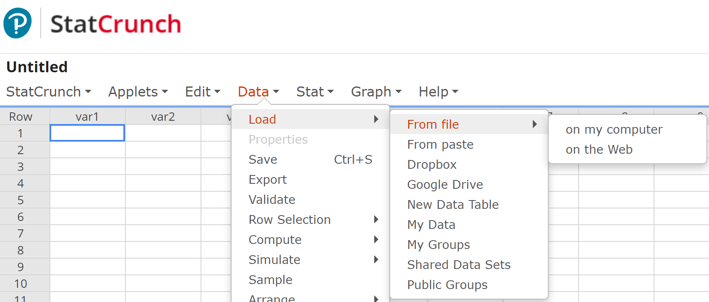
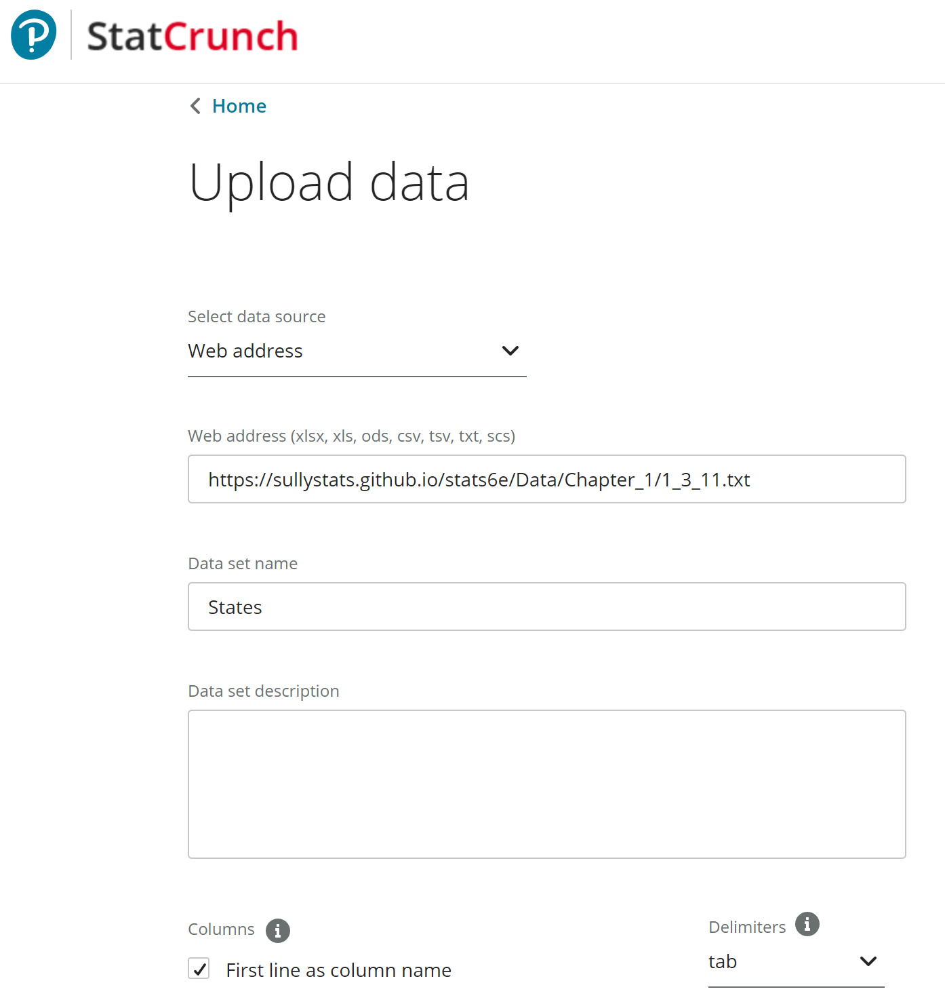

# Loading Data into StatCrunch from Github

<b>Step 1:</b>  Open StatCrunch.

<b>Step 2:</b>  Select Data > Load > From file > on the Web

<b>Step 3:</b>  Fill in the window as shown below.  Be sure to select "tab" under delimeter. 

<b>Note:</b>  All data sets on SullyStats Github are of the form

     https://sullystats.github.io/stats6e/Data/Chapter_#/#_s_n.txt
     
where
<ul>
     <li># is the chapter number</li>
     <li>s is the section number</li>
     <li>n is the problem number</li>
</ul>
<b>Step 4:</b>  Click Upload. 
