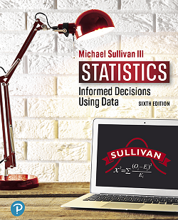

<h2>Data Site for Statistics: Informed Decisions Using Data 6e by Michael Sullivan, III</h2>

   

Most of the data that accompanies this text can be retrieved using the URL
 https://sullystats.github.io/stats6e/Data/Chapter_#/#_s_n.txt 

where
<ul>
   <li># represents the chapter number</li>
   <li>s represents the section number</li>
   <li>n reprsents the problem number</li>
</ul>

For problems in the chapter review, use "r" for the section number.
For problems in the chapter test, use "ct" for the section number. 

For example, to retrieve the data set for Problem 31 in Section 4.1, use the URL
 https://sullystats.github.io/stats6e/Data/Chapter_4/4_1_31.txt 

To retrieve the data for Problem 10 in the Chapter 2 Review, use the URL
 https://sullystats.github.io/stats6e/Data/Chapter_2/2_r_10.txt 

<h3>Loading Data into StatCrunch from Github</h3>

[Loading Data to StatCrunch](StatCrunch/)

<h3>Loading Data into R Studio from Github</h3>

[Loading Data to R Studio](R/)

